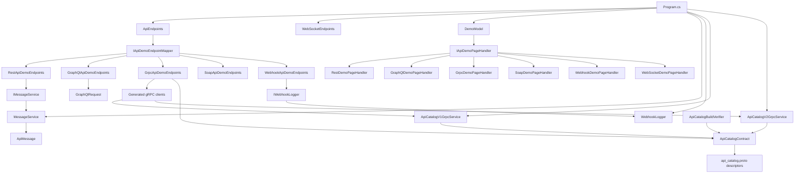
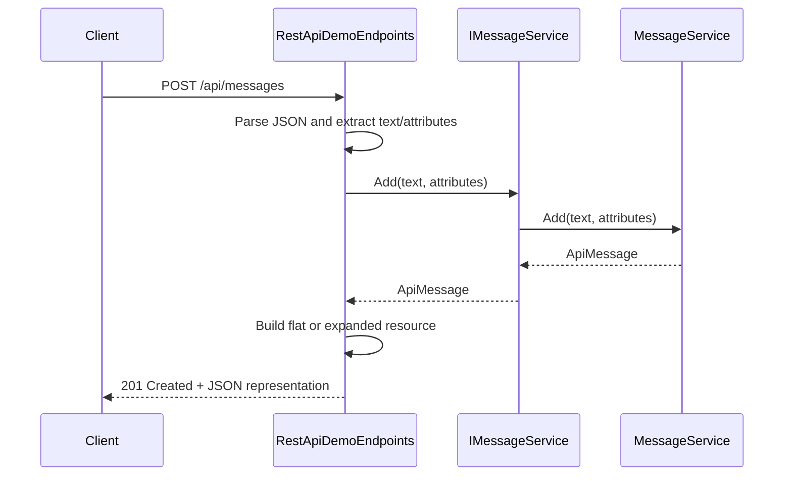
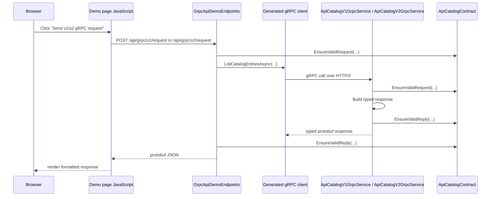
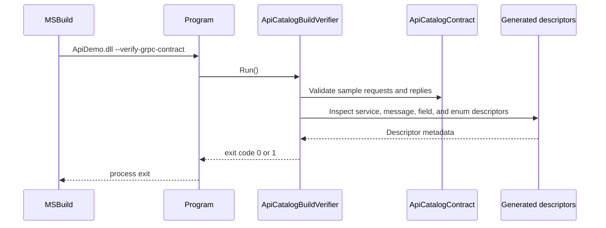

# Design and Class Interaction Guide

This document explains how the main classes in this repository collaborate at runtime and at build time.

## Purpose

The application is a small ASP.NET Core demo hub that shows multiple API styles:

- SOAP
- gRPC
- GraphQL
- REST
- Webhook
- WebSocket

The codebase has two main execution paths:

1. UI path: Razor Pages render explanatory demo pages.
2. API path: Minimal API endpoints and gRPC services process demo requests.

There is also one important build-time path:

1. Contract verification path: a custom gRPC verifier runs during `dotnet build`.

## High-Level Structure

```text
Program.cs
|- Registers ASP.NET Core services and transport listeners
|- Maps gRPC services
|- Maps /api endpoints
|- Maps /ws endpoint
`- Maps Razor Pages

Endpoints/
|- ApiEndpoints.cs              -> discovers and maps API endpoint mappers
|- WebSocketEndpoints.cs        -> maps the standalone WebSocket endpoint
`- ApiTypes/*                   -> one mapper per API style

Pages/
|- Demo.cshtml.cs               -> discovers and applies page handlers
|- Demo.cshtml                  -> renders the selected demo view
`- DemoLogic/*                  -> one page handler per API style

Services/
|- MessageService.cs            -> in-memory state for REST demos
|- WebhookLogger.cs             -> file logger for webhook demos
`- Grpc/*                       -> strict gRPC contract runtime and build verification

Models/
`- ApiMessage.cs                -> shared data model for REST and GraphQL request parsing

Protos/
`- api_catalog.proto            -> source of the generated gRPC contract types
```

## Main Runtime Relationships



## Bootstrap Flow

`Program.cs` is the composition root.

Responsibilities:

- Enables a dual-listener Kestrel setup:
  - HTTP/1.1 on `localhost:5089`
  - HTTP/2 on `localhost:5090`
- Registers application services:
  - `IMessageService -> MessageService`
  - `IWebhookLogger -> WebhookLogger`
- Maps:
  - gRPC services
  - minimal API endpoints under `/api`
  - WebSocket endpoint at `/ws`
  - Razor Pages
- Short-circuits normal startup when launched with `--verify-grpc-contract`

Design consequence:

- `Program.cs` is the only place that knows the whole system composition.
- Everything else is either discovered by reflection or resolved through ASP.NET Core DI.

## Reflection-Based Discovery

Two subsystems use reflection to stay extensible without manual registration lists.

### 1. API mapper discovery

`ApiEndpoints.MapApiEndpoints()` scans the executing assembly for every class implementing `IApiDemoEndpointMapper`, creates each mapper with `Activator.CreateInstance`, and calls `Map(api)`.

Implications:

- To add a new API demo endpoint, implement `IApiDemoEndpointMapper`.
- Mappers must be parameterless because they are instantiated via reflection.
- Dependencies should be taken through minimal API handler parameters, not constructor injection.

### 2. Demo page handler discovery

`DemoModel.OnGet()` scans the assembly for every class implementing `IApiDemoPageHandler`, builds a dictionary by `Id`, and applies the matching handler.

Implications:

- To add a new demo page, implement `IApiDemoPageHandler`.
- Page handlers are also parameterless and configured by mutation of `DemoModel`.
- The UI is data-driven by handler-populated properties, not by one Razor page per API type.

## Class Interaction by Area

## UI Rendering Path

Main classes:

- `DemoModel`
- `IApiDemoPageHandler`
- `*DemoPageHandler`
- `Demo.cshtml`
- `Index.cshtml`

Flow:

1. Browser requests `/Demo/{id}`.
2. `DemoModel.OnGet()` normalizes query parameters like `method` and `example`.
3. `DemoModel` finds the matching `IApiDemoPageHandler` by `Id`.
4. The selected handler mutates `DemoModel` properties.
5. `Demo.cshtml` renders the appropriate section based on flags like `IsRestDemo` or `IsGrpcDemo`.

Notes:

- The UI does not call services directly.
- The gRPC page is the only page with active browser-side behavior: JavaScript posts to `/api/grpc/v1/request` or `/api/grpc/v2/request`.
- `Index.cshtml` is only navigation; it does not participate in request processing beyond linking to `/Demo/{id}`.

## REST Path

Main classes:

- `RestApiDemoEndpoints`
- `IMessageService`
- `MessageService`
- `ApiMessage`

Responsibilities:

- `RestApiDemoEndpoints` owns HTTP contract behavior:
  - request parsing
  - tolerant field alias handling
  - additive attribute handling
  - flat vs expanded resource rendering
- `MessageService` owns in-memory message storage and merge behavior.
- `ApiMessage` is the stored resource shape.

Interaction details:

- Endpoint handlers ask `IMessageService` for CRUD operations.
- `MessageService` clones and merges `JsonObject` attributes so callers cannot mutate stored state through shared references.
- `RestApiDemoEndpoints` transforms service models into HTTP resource representations. The service does not know about `_links`, `_meta`, or query options like `view=expanded`.

Design consequence:

- Transport concerns stay in the endpoint mapper.
- Domain state stays in `MessageService`.
- The REST demo is intentionally loose: the service model is stable while the HTTP representation can evolve.

### REST sequence



## GraphQL Path

Main classes:

- `GraphQlApiDemoEndpoints`
- `GraphQlRequest`

Responsibilities:

- `GraphQlApiDemoEndpoints` parses a `GraphQlRequest`, inspects the raw query string, and returns a hard-coded shaped response.
- `GraphQlRequest` is only a transport DTO for request deserialization.

Design consequence:

- This is a transport demo, not a full GraphQL engine.
- There is no resolver layer, schema registry, or domain service behind it.

## SOAP Path

Main classes:

- `SoapApiDemoEndpoints`

Responsibilities:

- Reads raw XML from the request body.
- Escapes the body and embeds it in a SOAP envelope response.

Design consequence:

- The SOAP demo is intentionally simple and does not use a WSDL/XSD-backed service model.
- All SOAP behavior is concentrated in one endpoint mapper.

## Webhook Path

Main classes:

- `WebhookApiDemoEndpoints`
- `IWebhookLogger`
- `WebhookLogger`

Responsibilities:

- `WebhookApiDemoEndpoints` receives raw request payloads.
- `WebhookLogger` appends them to `webhook.log`.

Design consequence:

- The endpoint does not parse a schema.
- Persistence is a side effect delegated to a single service abstraction, which keeps the endpoint logic small.

## WebSocket Path

Main classes:

- `WebSocketEndpoints`

Responsibilities:

- Validates that the request is a WebSocket upgrade.
- Accepts the socket.
- Echoes text frames back as `"Server echo: ..."`

Design consequence:

- WebSocket support is not routed through `IApiDemoEndpointMapper`.
- It is mounted separately because it behaves as a standalone socket endpoint rather than a grouped `/api` demo mapper.

## gRPC Path

Main classes:

- `GrpcApiDemoEndpoints`
- `ApiCatalogV1GrpcService`
- `ApiCatalogV2GrpcService`
- `ApiCatalogContract`
- generated classes in `FunctionalProgramming.Grpc`
- `api_catalog.proto`

This is the most tightly-coupled part of the system.

### Generated type boundary

`Protos/api_catalog.proto` generates:

- service bases:
  - `ApiCatalogV1.ApiCatalogV1Base`
  - `ApiCatalogV2.ApiCatalogV2Base`
- service clients:
  - `ApiCatalogV1.ApiCatalogV1Client`
  - `ApiCatalogV2.ApiCatalogV2Client`
- request/response/message/enum types in `FunctionalProgramming.Grpc`

All gRPC runtime classes depend on those generated types.

### How this repo uses `api_catalog.proto`

Think of `api_catalog.proto` as the source of truth for the strict gRPC side of the repo.

At build time:

1. `ApiDemo.csproj` includes `Protos/api_catalog.proto` with `GrpcServices="Both"`.
2. The protobuf/gRPC tooling generates:
   - server base classes
   - client classes
   - request/response/message classes
   - enum types
   - descriptors for services, messages, fields, and enums

At runtime:

1. `Program.cs` maps the concrete server implementations:
   - `ApiCatalogV1GrpcService`
   - `ApiCatalogV2GrpcService`
2. Those classes implement the generated server base classes from the proto.
3. `GrpcApiDemoEndpoints` creates generated client classes from the same proto and calls the gRPC service over HTTP/2.
4. `ApiCatalogContract` reads the generated descriptors from the proto and enforces the strict rules embedded in the schema.
5. `ApiCatalogBuildVerifier` also reads the generated descriptors and fails the build if the generated surface drifts from the expected design.

In other words:

```text
api_catalog.proto
-> generated C# types and descriptors
-> server implementation classes inherit generated bases
-> HTTP bridge creates generated clients
-> contract validator reads generated descriptors
-> build verifier checks generated shape
```

### How to read `api_catalog.proto`

Read the file from top to bottom in this order.

#### 1. File-level settings

At the top of the file:

- `syntax = "proto3";`
  - tells you the protobuf language version
- `option csharp_namespace = "FunctionalProgramming.Grpc";`
  - tells you which C# namespace the generated types will live in
- `package api_catalog;`
  - contributes to the protobuf full names, such as `api_catalog.ApiCatalogV1`

If you want to know where the generated C# classes come from, these three lines are the first place to look.

#### 2. Custom schema options

This file extends protobuf descriptor types:

- `google.protobuf.FieldOptions`
- `google.protobuf.MessageOptions`

That is where the custom strict metadata comes from:

- `strict_required`
- `strict_string_pattern`
- `strict_semantic_type`
- `strict_min_items`
- `strict_contract`

These are not standard protobuf keywords. They are repo-specific schema annotations used by:

- `ApiCatalogContract`
- `ApiCatalogBuildVerifier`

If you see a field like:

```proto
string contract_version = 1 [
  (strict_required) = true,
  (strict_string_pattern) = "^api-catalog\\.v2$"
];
```

that means the repo is not just using protobuf for serialization. It is also using the schema as a governance and validation source.

#### 3. Services

The `service` blocks tell you which RPC endpoints exist.

Example:

```proto
service ApiCatalogV2 {
  rpc ListCatalogEntries (ListApiCatalogEntriesV2Request) returns (ListApiCatalogEntriesV2Response);
}
```

How to interpret that:

- service name: `ApiCatalogV2`
- RPC name: `ListCatalogEntries`
- request type: `ListApiCatalogEntriesV2Request`
- response type: `ListApiCatalogEntriesV2Response`

What this generates in C#:

- server base class: `ApiCatalogV2.ApiCatalogV2Base`
- client class: `ApiCatalogV2.ApiCatalogV2Client`
- server override point:
  - `ListCatalogEntries(ListApiCatalogEntriesV2Request, ServerCallContext)`
- client call:
  - `ListCatalogEntriesAsync(ListApiCatalogEntriesV2Request, ...)`

Where those are used in this repo:

- server implementation: `ApiCatalogV2GrpcService`
- client-side caller: `GrpcApiDemoEndpoints`

#### 4. Messages

The `message` blocks define the shape of requests, responses, and nested objects.

Example:

```proto
message ListApiCatalogEntriesV2Request {
  string contract_version = 1 [...];
  string requesting_client_name = 2 [...];
}
```

How to read that:

- `message ListApiCatalogEntriesV2Request`
  - this becomes a generated C# class
- `contract_version = 1`
  - field name is `contract_version`
  - field number is `1`
  - generated C# property name is `ContractVersion`
- `requesting_client_name = 2`
  - field name is `requesting_client_name`
  - field number is `2`
  - generated C# property name is `RequestingClientName`

Field numbers matter because they are the stable wire identifiers. Renaming a field is less dangerous than changing its field number.

#### 5. Enums

The `enum` blocks define governed value sets.

Example:

```proto
enum ApiCatalogEntryKindV2 {
  API_CATALOG_ENTRY_KIND_V2_REST = 1;
  API_CATALOG_ENTRY_KIND_V2_ASYNCAPI = 7;
}
```

How to read that:

- this becomes a generated C# enum
- the numeric values are part of the wire contract
- `ApiCatalogBuildVerifier` explicitly checks some numeric values to prevent accidental evolution mistakes

That means enum evolution here is deliberate, not informal.

#### 6. Reserved fields and names

When you see:

```proto
reserved 5 to 15;
reserved "label", "description";
```

read that as:

- these field numbers must not be reused
- these field names must not be reused

This is a compatibility tool. It prevents accidental reintroduction of old meanings during schema evolution.

#### 7. Repeated fields

When you see:

```proto
repeated ApiCatalogEntryV2 catalog_entries = 2 [...]
```

that means:

- the generated C# property is a collection
- in this repo, `ApiCatalogContract` can enforce list-level rules such as minimum item count through `strict_min_items`

#### 8. Message-level contract version

When you see:

```proto
option (strict_contract) = "api-catalog.v2";
```

that means every instance of that message belongs to a governed contract version. `ApiCatalogContract` uses this to ensure nested messages do not silently mix versions.

### Fast way to understand one RPC in this repo

If you want to understand `ListCatalogEntries`, use this order:

1. Find the service line in `api_catalog.proto`
2. Read the request message
3. Read the response message
4. Read any nested metadata message used by the response
5. Read the enum used by the response items
6. Open `ApiCatalogGrpcService.cs` and find the matching override
7. Open `GrpcApiDemoEndpoints.cs` and find the matching client call
8. Open `ApiCatalogContract.cs` to see which schema annotations are enforced
9. Open `ApiCatalogBuildVerifier.cs` to see which aspects are build-gated

For `ListCatalogEntries`, that path is:

```text
api_catalog.proto
-> service ApiCatalogV1 / ApiCatalogV2
-> ListApiCatalogEntriesV1Request or ListApiCatalogEntriesV2Request
-> ListApiCatalogEntriesV1Response or ListApiCatalogEntriesV2Response
-> ApiCatalogEntryV1 or ApiCatalogEntryV2
-> ApiCatalogV1GrpcService or ApiCatalogV2GrpcService
-> GrpcApiDemoEndpoints
-> ApiCatalogContract
-> ApiCatalogBuildVerifier
```

### How to change the proto safely

Use this checklist when editing `api_catalog.proto`:

1. Change the proto definition first.
2. Keep field numbers stable unless you are intentionally creating a breaking change.
3. Use `reserved` when retiring old fields or names.
4. Update:
   - `ApiCatalogGrpcService.cs`
   - `ApiCatalogContract.cs`
   - `ApiCatalogBuildVerifier.cs`
   - `GrpcApiDemoEndpoints.cs`
   - `GrpcDemoPageHandler.cs`
5. Run `dotnet build`.
6. Treat verifier failures as contract drift, not as build noise.

### Runtime interaction

- `GrpcApiDemoEndpoints` is an HTTP bridge for the Razor demo.
  - It creates a gRPC client channel to `localhost:5090`.
  - It builds typed request messages.
  - It validates requests and responses through `ApiCatalogContract`.
  - It serializes protobuf replies to JSON for browser display.
- `ApiCatalogV1GrpcService` and `ApiCatalogV2GrpcService` are the actual gRPC servers.
  - They inherit from generated base classes.
  - They create typed response messages.
  - They validate both request and reply through `ApiCatalogContract`.

### Direct caller/callee map for `ApiCatalogGrpcService.cs`

Important naming note:

- The file `Services/Grpc/ApiCatalogGrpcService.cs` does not contain one class named `ApiCatalogGrpcService`.
- It contains two concrete service classes:
  - `ApiCatalogV1GrpcService`
  - `ApiCatalogV2GrpcService`

If you want to know "who calls `ApiCatalogGrpcService`", the concrete answer is "who reaches `ApiCatalogV1GrpcService` or `ApiCatalogV2GrpcService`".

#### `ApiCatalogV1GrpcService`

Who calls it:

1. `Program.cs` registers it with `app.MapGrpcService<ApiCatalogV1GrpcService>()`.
2. ASP.NET Core gRPC middleware dispatches matching HTTP/2 calls to its `ListCatalogEntries(...)` method.
3. In the demo flow, `GrpcApiDemoEndpoints.CallV1Async()` reaches it indirectly by creating `ApiCatalogV1.ApiCatalogV1Client` and calling `ListCatalogEntriesAsync(...)`.

What it calls directly:

1. `ApiCatalogContract.EnsureValidRequest(request)`
2. `ApiCatalogContract.CreateV1Metadata()`
3. Generated protobuf message constructors:
   - `ListApiCatalogEntriesV1Response`
   - `ApiCatalogEntryV1`
4. `response.CatalogEntries.AddRange(...)`
5. `ApiCatalogContract.EnsureValidReply(response)`
6. `Task.FromResult(response)`

What it does not call:

- No repository
- No database
- No `MessageService`
- No `WebhookLogger`
- No other custom service besides `ApiCatalogContract`

Its data is currently hard-coded inside the service method.

#### `ApiCatalogV2GrpcService`

Who calls it:

1. `Program.cs` registers it with `app.MapGrpcService<ApiCatalogV2GrpcService>()`.
2. ASP.NET Core gRPC middleware dispatches matching HTTP/2 calls to its `ListCatalogEntries(...)` method.
3. In the demo flow, `GrpcApiDemoEndpoints.CallV2Async()` reaches it indirectly by creating `ApiCatalogV2.ApiCatalogV2Client` and calling `ListCatalogEntriesAsync(...)`.

What it calls directly:

1. `ApiCatalogContract.EnsureValidRequest(request)`
2. `ApiCatalogContract.CreateV2Metadata()`
3. Generated protobuf message constructors:
   - `ListApiCatalogEntriesV2Response`
   - `ApiCatalogEntryV2`
4. `response.CatalogEntries.AddRange(...)`
5. `ApiCatalogContract.EnsureValidReply(response)`
6. `Task.FromResult(response)`

What it does not call:

- No repository
- No database
- No `MessageService`
- No `WebhookLogger`
- No other custom service besides `ApiCatalogContract`

#### `GrpcApiDemoEndpoints`

Who calls it:

1. `ApiEndpoints.MapApiEndpoints()` discovers it by reflection because it implements `IApiDemoEndpointMapper`.
2. ASP.NET Core minimal API routing invokes its mapped handlers:
   - `POST /api/grpc/request`
   - `POST /api/grpc/v1/request`
   - `POST /api/grpc/v2/request`
3. For the browser demo, the JavaScript in `Pages/Demo.cshtml` triggers those HTTP endpoints.

What it calls directly:

1. `ResolveGrpcAddress(...)`
2. `GrpcChannel.ForAddress(...)`
3. Generated clients:
   - `ApiCatalogV1.ApiCatalogV1Client`
   - `ApiCatalogV2.ApiCatalogV2Client`
4. Generated request messages:
   - `ListApiCatalogEntriesV1Request`
   - `ListApiCatalogEntriesV2Request`
5. `ApiCatalogContract.EnsureValidRequest(...)`
6. `client.ListCatalogEntriesAsync(...)`
7. `ApiCatalogContract.EnsureValidReply(...)`
8. `JsonFormatter.Default.Format(...)`

#### Short call chain

```text
Demo.cshtml JavaScript
-> /api/grpc/v1/request or /api/grpc/v2/request
-> GrpcApiDemoEndpoints
-> generated gRPC client
-> ASP.NET Core gRPC middleware
-> ApiCatalogV1GrpcService or ApiCatalogV2GrpcService
-> ApiCatalogContract
-> generated protobuf response types
```

### Contract validation interaction

`ApiCatalogContract` is the enforcement hub.

Responsibilities:

- creates response metadata
- reads protobuf descriptor metadata
- validates required fields
- validates regex rules
- validates repeated field minimums
- validates governed enum values
- ensures nested message contract versions stay consistent

Design consequence:

- The gRPC services do not carry custom validation logic inline.
- Both client-side demo calls and server-side implementations share the same contract enforcement rules.

### gRPC request sequence



## Build-Time Verification Path

Main classes:

- `ApiDemo.csproj`
- `Program.cs`
- `ApiCatalogBuildVerifier`
- `ApiCatalogContract`
- generated protobuf descriptors

Flow:

1. `dotnet build` compiles the project.
2. MSBuild target `VerifyGrpcContract` runs after build.
3. That target executes `ApiDemo.dll --verify-grpc-contract`.
4. `Program.cs` detects the flag and calls `ApiCatalogBuildVerifier.Run()`.
5. `ApiCatalogBuildVerifier` validates:
   - generated client/server type presence
   - service names and RPC signatures
   - message-level strict contract tags
   - field-level required/pattern/min-items metadata
   - enum evolution rules
6. The verifier exits with a non-zero code on drift, failing the build.

Design consequence:

- The gRPC design is enforced before runtime.
- Contract drift is caught even when application code still compiles.

### Build verification sequence



## Class Interaction Matrix

| Class or file | Called or created by | Calls directly | Primary responsibility |
| --- | --- | --- | --- |
| `Program.cs` | process entrypoint | ASP.NET Core host builder, DI registration, `MapGrpcService`, `MapApiEndpoints`, `MapWebSocketEndpoints`, `MapRazorPages`, `ApiCatalogBuildVerifier.Run()` when flagged | Application composition root |
| `ApiEndpoints` | `Program.cs` | reflection over `IApiDemoEndpointMapper`, `mapper.Map(api)` | Reflective mapping of `/api` demos |
| `WebSocketEndpoints` | `Program.cs` | ASP.NET Core WebSocket APIs | Standalone socket endpoint |
| `DemoModel` | Razor Pages runtime | reflection over `IApiDemoPageHandler`, `handler.Apply(...)` | Reflective page selection and view-model mutation |
| `Demo.cshtml` | Razor Pages runtime | browser `fetch(...)` to `/api/grpc/v1/request` and `/api/grpc/v2/request` | Conditional rendering of demo UI |
| `RestApiDemoEndpoints` | `ApiEndpoints` via reflection | `IMessageService` methods, local parsing/render helpers | Loose REST transport behavior |
| `MessageService` | DI into REST handlers | `ApiMessage`, local clone/merge helpers | In-memory REST state |
| `GraphQlApiDemoEndpoints` | `ApiEndpoints` via reflection | `JsonSerializer.DeserializeAsync<GraphQlRequest>` | Simple GraphQL transport demo |
| `SoapApiDemoEndpoints` | `ApiEndpoints` via reflection | request body reader, `WriteAsync(...)` | Simple SOAP echo demo |
| `WebhookApiDemoEndpoints` | `ApiEndpoints` via reflection | `IWebhookLogger.LogOrderPayloadAsync(...)` | Webhook receive-and-log demo |
| `WebhookLogger` | DI into webhook handlers | `File.AppendAllTextAsync(...)` | File-based webhook persistence |
| `GrpcApiDemoEndpoints` | `ApiEndpoints` via reflection; browser `fetch(...)` reaches its routes | `ResolveGrpcAddress`, `GrpcChannel.ForAddress`, generated gRPC clients, generated request messages, `ApiCatalogContract`, `JsonFormatter` | HTTP bridge from browser to real gRPC calls |
| `ApiCatalogV1GrpcService` | `Program.cs` registration; ASP.NET Core gRPC middleware dispatch; indirect calls from `GrpcApiDemoEndpoints` through generated v1 client | `ApiCatalogContract`, generated v1 response/message types, `Task.FromResult(...)` | Strict v1 gRPC server |
| `ApiCatalogV2GrpcService` | `Program.cs` registration; ASP.NET Core gRPC middleware dispatch; indirect calls from `GrpcApiDemoEndpoints` through generated v2 client | `ApiCatalogContract`, generated v2 response/message types, `Task.FromResult(...)` | Strict v2 gRPC server |
| `ApiCatalogContract` | `GrpcApiDemoEndpoints`, `ApiCatalogV1GrpcService`, `ApiCatalogV2GrpcService`, `ApiCatalogBuildVerifier` | protobuf descriptors, regex validation, generated metadata types | Descriptor-driven gRPC runtime validation |
| `ApiCatalogBuildVerifier` | `Program.cs` in `--verify-grpc-contract` mode; MSBuild post-build target | `ApiCatalogContract`, generated descriptors, generated types | Build-time gRPC drift detection |
| `api_catalog.proto` | protobuf code generation | no runtime calls; produces generated services/messages/descriptors | Source of strict gRPC contract |

## Extension Points

### Add a new API demo

1. Implement `IApiDemoEndpointMapper`.
2. Implement `IApiDemoPageHandler`.
3. Add a link on `Index.cshtml` if you want UI navigation.

No manual registration is needed because both endpoint mappers and page handlers are discovered by reflection.

### Change the REST demo shape

The normal edit path is:

1. `Models/ApiMessage.cs`
2. `Services/MessageService.cs`
3. `Endpoints/ApiTypes/RestApiDemoEndpoints.cs`
4. `Pages/DemoLogic/RestDemoPageHandler.cs`

### Change the strict gRPC contract

The normal edit path is:

1. `Protos/api_catalog.proto`
2. `Services/Grpc/ApiCatalogContract.cs`
3. `Services/Grpc/ApiCatalogGrpcService.cs`
4. `Endpoints/ApiTypes/GrpcApiDemoEndpoints.cs`
5. `Services/Grpc/ApiCatalogBuildVerifier.cs`
6. `Pages/DemoLogic/GrpcDemoPageHandler.cs`

If the build verifier fails after a proto change, treat that as design drift that still needs explicit reconciliation.

## Non-Obvious Constraints

- Endpoint mapper classes and page handlers are created with `Activator.CreateInstance`, so constructor injection is not available there.
- `MessageService` is a singleton with in-memory state. It is demo state, not persistent storage.
- `WebhookLogger` writes directly to `webhook.log`, so webhook processing has a filesystem side effect.
- The GraphQL, SOAP, and WebSocket implementations are intentionally simple demos rather than production-grade protocol stacks.
- The gRPC design is different from the others: it is both runtime-validated and build-validated against descriptor metadata.

## Recommended Reading Order

If you are new to the repo, read in this order:

1. `Program.cs`
2. `Endpoints/ApiEndpoints.cs`
3. `Pages/Demo.cshtml.cs`
4. `Endpoints/ApiTypes/RestApiDemoEndpoints.cs`
5. `Services/MessageService.cs`
6. `Endpoints/ApiTypes/GrpcApiDemoEndpoints.cs`
7. `Services/Grpc/ApiCatalogGrpcService.cs`
8. `Services/Grpc/ApiCatalogContract.cs`
9. `Services/Grpc/ApiCatalogBuildVerifier.cs`
10. `Protos/api_catalog.proto`
